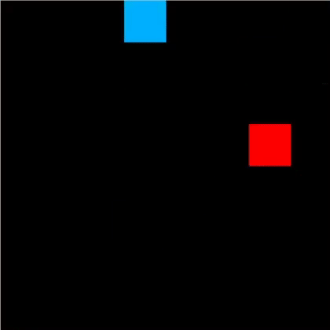

# Microcontroller-II-final-project
Didactic project about Reinforcement Learning: an arcade game implemented with an STM32 microcontroller and a graphical display (like those for old Nokia cellphones), where your goal is to prevent an AI-controlled agent to reach a given point in the map.

The AI agent (blue) aims to navigate its way as quickly as possible to the target (green), while avoiding the player (red):

Everything was implemented in pure C++. An initial protopype was developed in Python (it's the first gif you see above), whose code was highly based on a tutorial from !(Python Programming)[https://pythonprogramming.net/q-learning-reinforcement-learning-python-tutorial/] [1].

## AI problem formulation
The AI agent has partial knowledge about the environment: it knows the x and y deltas for the food and enemy, with precision depending on the distance. If the food or the enemy is far away, the agent only knows its general direction. The agent can execute 4 actions: move up, down, left or right. 

The Q table can be implemented as a dictionary `[[s0,s1],[s2,s3]] -> [a0, a1, a2, a3]`, or as a vector of 5 dimentions. If implemented as a vector, it will have `ACTION_SIZE*(OBS_SIZE*2 -1)^4` elements. In the STM implementation we used OBS_SIZE=3 and ACTION_SIZE=4, therefore it has 2500 elements.

# Lessons learned
By making the environment partially observable, learning became more difficult. The ideal would be to have a probabilistic representation of the environment (ex: HMM), and not deterministic as is the Q-table. 

By changing the possible actions (not diagonal), learning became easier. The fact that planning is only 1 step ahead seems to make it very difficult to learn on large maps.

# References
[1] - Python Programming. Q-learning Tutorial. Available in https://pythonprogramming.net/q-learning-reinforcement-learning-python-tutorial/.

[2] - Sutton & Barto, 2018. Reinforcement Learning: An Introduction. The MIT Press.

[3] - Mark Hammond, 2017. Deep Reinforcement Learning in the Enterprise: Bridging the Gap from Games to Industry.

[4] - Derik Pridmore, 2017. Industrial robotics and deep reinforcement learning.

